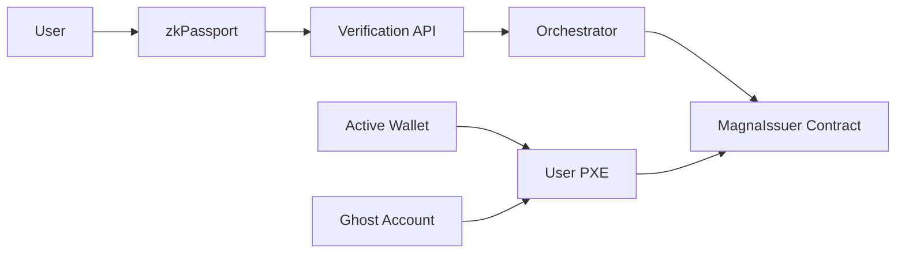
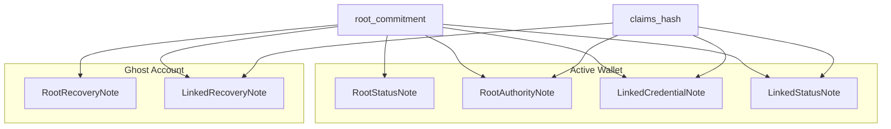
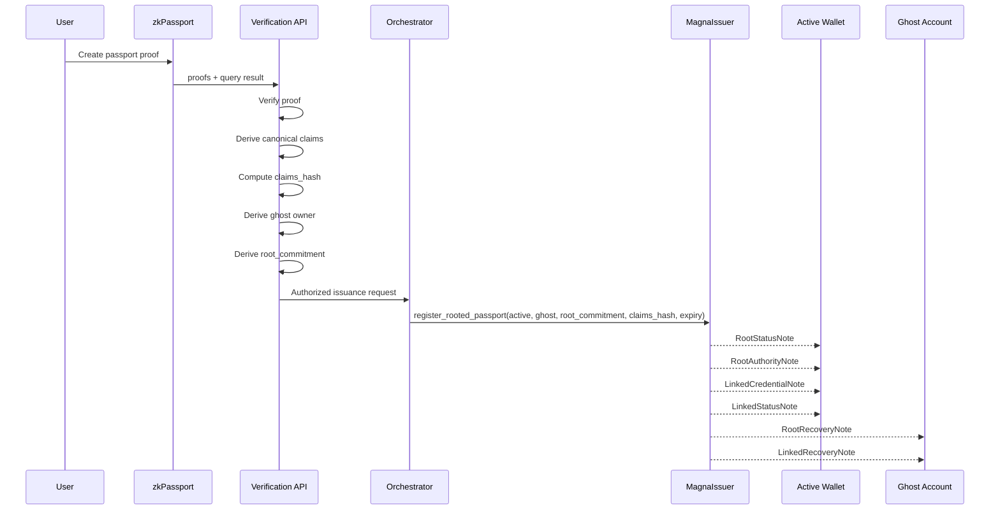
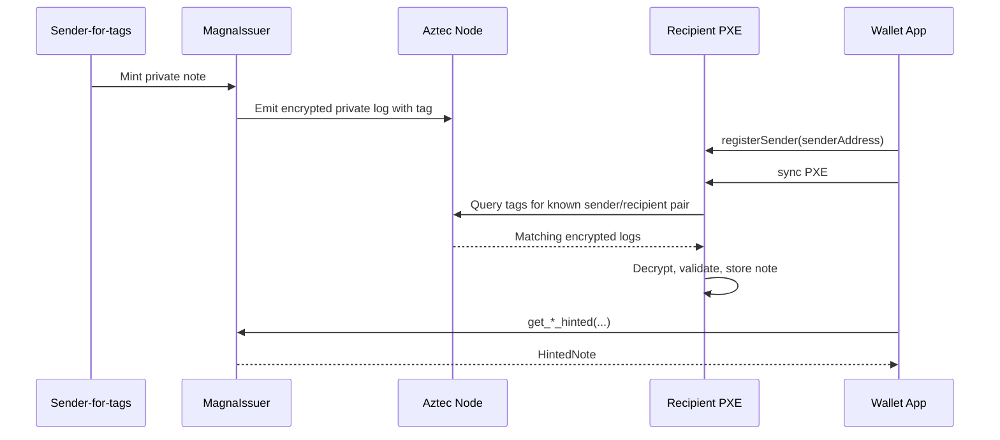
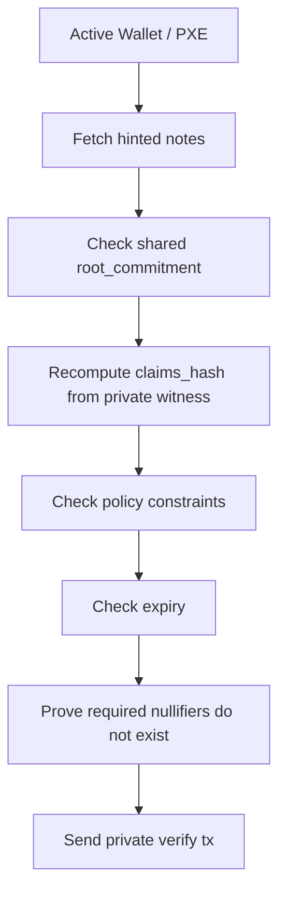
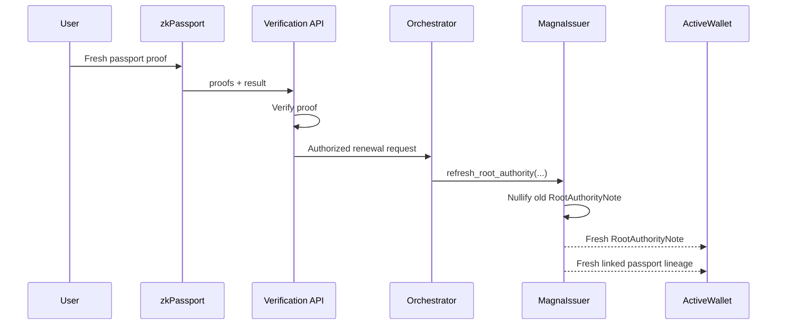
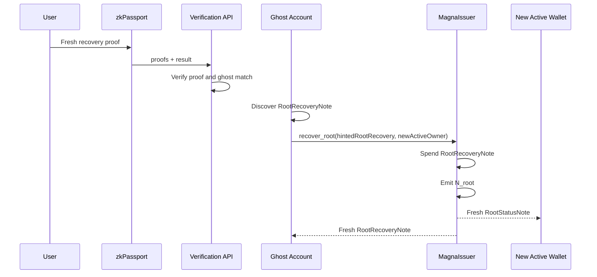
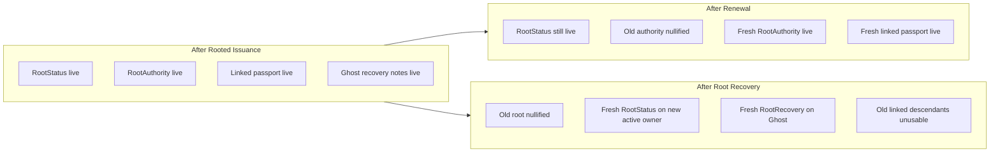

# Magna System Explainer

This document explains the Magna system from scratch.

It is based on the current repository behavior and terminology in:

- `docs/protocol-spec.md`
- `docs/integration-guide.md`
- `docs/data-minimization.md`
- `contracts/magna-issuer/src/main.nr`
- Aztec note discovery documentation: <https://docs.aztec.network/developers/docs/foundational-topics/advanced/storage/note_discovery>

The canonical model in this repository is the **root-linked** model. The older **rootless** model still exists for compatibility, but rooted mode is the system you should think of as the main design.

## 1. Big Picture

Magna is a private credential system built on Aztec.

At a high level:

1. A user proves passport facts with zkPassport.
2. Magna converts the proven facts into a private Aztec note lineage.
3. Later, the user proves those notes satisfy a policy without revealing the note contents publicly.
4. Recovery and renewal are handled by separate note flows.

The most important idea is:

- `claims_hash` answers: "What exact credential facts were committed?"
- `root_commitment` answers: "Which long-lived root lineage does this credential belong to?"

## 2. Main Actors

| Actor | What it is | Main job |
| --- | --- | --- |
| User active wallet | The day-to-day Aztec account the user verifies with | Owns active notes used during verify |
| Ghost account | A deterministic recovery-only Aztec account derived from zkPassport material | Owns recovery notes and performs recovery |
| zkPassport | External identity proof system | Produces proofs for nationality, age threshold, passport expiry, and a scoped `uniqueIdentifier` |
| Verification API | Backend verifier | Verifies fresh zkPassport proofs before issuance or renewal or recovery preflight |
| Orchestrator | Trusted issuer-side Aztec account | The only allowed sender for issuance and rooted authority refresh entrypoints |
| PXE | Private Execution Environment in the wallet | Discovers notes, stores note preimages, builds private proofs |
| Magna issuer contract | Main Aztec contract | Stores note lineages and enforces verify, recovery, and renewal rules |

## 3. Architecture Overview



## 4. Core Terms

### 4.1 What is a note?

On Aztec, a note is private state.

In Magna, a note is the private object that represents things like:

- "this wallet has a valid passport credential"
- "this wallet has a rooted lineage"
- "this ghost account can recover that lineage"

Notes are not plain public rows onchain. Their commitments are onchain, but their contents are private and discovered through Aztec note discovery.

### 4.2 What is a hinted note?

A hinted note is the note plus the extra metadata Aztec needs to use it in a proof later.

In this repo, the contract has helper functions such as:

- `get_credential_hinted(...)`
- `get_status_hinted(...)`
- `get_root_status_hinted(...)`
- `get_root_authority_hinted(...)`
- `get_root_recovery_hinted(...)`

Those read from the caller's discovered notes and return a `HintedNote<...>`.

### 4.3 What is `claims_hash`?

`claims_hash` is the commitment to the credential facts.

For passport credentials in this repo:

```text
claims_hash =
  H(
    MAGNA_CLAIMS_DS,
    schema_version,
    credential_type,
    nationality_alpha3_packed,
    min_age_proven,
    expiry_ts
  )
```

So `claims_hash` is not random. It is the deterministic commitment to the canonical claims.

It means:

- if nationality changes, `claims_hash` changes
- if minimum age proof changes, `claims_hash` changes
- if expiry changes, `claims_hash` changes

### 4.4 What is `root_commitment`?

`root_commitment` is the long-lived private root anchor in the rooted model.

Per the repo spec:

```text
root_commitment = H(MAGNA_ROOT_DS, uniqueIdentifier_field)
```

Important:

- it is opaque
- it is private
- it is not a public registry key
- it is not the same thing as `claims_hash`
- it is not the raw zkPassport `uniqueIdentifier`

`claims_hash` describes a specific credential payload.

`root_commitment` ties multiple credential states to the same long-lived private lineage.

### 4.5 What is the "root"?

In this system, "root" does **not** mean:

- the Ethereum root
- the Merkle root
- the user's wallet address

Here, the "root" means the private lineage anchored by `root_commitment`.

That lineage is represented by root notes:

- `RootStatusNote`
- `RootRecoveryNote`
- `RootAuthorityNote`

### 4.6 What is the ghost account?

The ghost account is a deterministic, recovery-only Aztec account.

It is derived from zkPassport material, not manually chosen by the user.

In the canonical derivation version:

```text
ghost_seed = H(MAGNA_GHOST_DS, uniqueIdentifier_field, credential_type)
```

The ghost account is important because it owns recovery notes, not daily verify notes.

It is **not** the user's routine wallet.

## 5. The Two Note Models

Magna currently has two note models:

1. legacy rootless
2. canonical rooted

### 5.1 Legacy rootless model

This is the older compatibility path.

| Note | Owner | Purpose |
| --- | --- | --- |
| `CredentialNote` | Active wallet | The committed credential facts |
| `StatusNote` | Active wallet | Revocation/status lineage for that credential |
| `RecoveryNote` | Ghost account | Recovery authority for that credential |

### 5.2 Rooted model

This is the canonical model now.

| Note | Owner | Purpose |
| --- | --- | --- |
| `RootStatusNote` | Active wallet | Says this active wallet currently owns the root lineage |
| `RootRecoveryNote` | Ghost account | Lets the ghost perform root-wide recovery |
| `RootAuthorityNote` | Active wallet | Says which passport claims are currently authoritative for the root |
| `LinkedCredentialNote` | Active wallet | The specific linked credential under the root |
| `LinkedStatusNote` | Active wallet | Revocation/status lineage for that linked credential |
| `LinkedRecoveryNote` | Ghost account | Per-linked-credential recovery/revocation authority |

## 6. Rooted Note Ownership Diagram



## 7. What Happens During Rooted Passport Issuance

The canonical onboarding entrypoint is `register_rooted_passport(...)`.

That single operation mints all the notes needed for rooted passport usage.

### 7.1 Issuance inputs

Before the contract call, the system needs:

- active owner address
- ghost owner address
- `root_commitment`
- `claims_hash`
- passport expiry timestamp

### 7.2 Where those values come from

- `claims_hash` comes from the canonical passport claims
- `root_commitment` comes from the scoped zkPassport identity root derivation
- ghost account comes from ghost derivation
- the orchestrator sends the issuance tx

### 7.3 What the contract mints

`register_rooted_passport(...)` mints:

- to the **active wallet**:
  - `RootStatusNote`
  - `RootAuthorityNote`
  - `LinkedCredentialNote`
  - `LinkedStatusNote`
- to the **ghost account**:
  - `RootRecoveryNote`
  - `LinkedRecoveryNote`

This is the direct answer to "what does the ghost account get at issuance?"

It gets the recovery-side notes, not the daily verify notes.

## 8. Rooted Issuance Diagram



## 9. How Magna Finds Notes

This part is critical.

Magna does **not** magically read any old note just because it exists onchain.

It depends on Aztec note discovery.

### 9.1 Aztec note discovery basics

Per the official Aztec documentation:

- notes are discovered using **note tagging**
- the recipient PXE must know the **sender-for-tags**
- the wallet must register known senders with `wallet.registerSender(senderAddress)`

That means:

- if the sender is unknown, the PXE may not discover the note
- if the note exists onchain but the sender was not registered, note getters can still fail

### 9.2 Why sender registration matters here

In Magna:

- the orchestrator mints issuance and rooted authority notes
- the active wallet or ghost wallet later tries to discover those notes in PXE

So both active and ghost note discovery need the sender-for-tags context for the orchestrator.

### 9.3 How the repo reads notes

The general pattern is:

1. make sure the account is deployed
2. register the relevant known sender(s)
3. sync PXE
4. call the appropriate `get_*_hinted(...)`
5. retry while note discovery is still catching up

### 9.4 Why "note not found" can still happen

A `notes.len() == 1` assertion failure usually means one of these:

1. the note truly does not exist for that owner/query
2. the note exists onchain but the wrong owner/query tuple is being used
3. the note exists but the PXE has not discovered it yet
4. the PXE cannot discover it because the sender-for-tags is not registered

## 10. Note Discovery Diagram



## 11. How Verification Works

Verification does not mean "ask zkPassport again every time."

Instead, normal Magna verification uses the existing private note lineage in the user's PXE.

### 11.1 Rootless verify

The legacy `verify(...)` path:

1. reads `CredentialNote` and `StatusNote`
2. recomputes `claims_hash` from the witness
3. checks policy constraints
4. checks expiry
5. proves the credential kill-switch nullifier does not already exist

### 11.2 Rooted verify

The canonical `verify_linked(...)` path:

1. reads:
   - `LinkedCredentialNote`
   - `LinkedStatusNote`
   - `RootStatusNote`
   - `RootAuthorityNote`
2. proves they share the same `root_commitment`
3. recomputes `claims_hash` from witness data
4. checks rooted authority validity
5. checks policy constraints
6. checks expiry windows
7. proves the relevant nullifiers do not already exist:
   - linked credential nullifier
   - root nullifier
   - root authority nullifier

For linked passport verification specifically, the authority note must also match the linked passport's `claims_hash`.

## 12. Verification Diagram



## 13. Nullifiers and Why They Matter

Magna invalidates lineages through nullifiers.

Think of a nullifier as the cryptographic signal that says:

"this old lineage has been spent or killed and must no longer verify."

The important ones are:

- `N`: legacy rootless credential kill-switch
- `N_linked`: linked credential kill-switch
- `N_root`: root-wide kill-switch
- `N_root_authority`: current rooted passport authority kill-switch

Verification succeeds only if the required nullifiers are proven not to exist at the anchor header.

## 14. Renewal vs Recovery

These are different flows.

### 14.1 Renewal

Renewal is for:

- passport renewed or replaced
- root should remain the same
- linked descendants should continue after authority refresh

The entrypoint is `refresh_root_authority(...)`.

It does **not** destroy the root.

It rotates the rooted passport authority note and remints the current linked passport lineage under the same `root_commitment`.

### 14.2 Recovery

Recovery is for:

- rotating control of the root lineage
- using the ghost account as the recovery authority

The entrypoint is `recover_root(...)`.

It is a root-wide kill-switch rotation.

It does **not** behave like renewal.

It nullifies the old root lineage and mints a fresh root status to the new active owner, plus a fresh root recovery note back to Ghost.

## 15. Renewal Diagram



## 16. Root Recovery Diagram



## 17. What Root Recovery Does to Existing Credentials

After `recover_root(...)`:

- the old root lineage is nullified
- old linked descendants remain present historically
- but they are no longer usable for verification
- the system must re-issue/re-link supported lineages under the rotated root state

This is why recovery is a kill-switch rotation, not a cosmetic ownership update.

## 18. What Each Step Gives to Active Wallet vs Ghost

### 18.1 Rooted issuance

**Active wallet gets:**

- `RootStatusNote`
- `RootAuthorityNote`
- `LinkedCredentialNote`
- `LinkedStatusNote`

**Ghost gets:**

- `RootRecoveryNote`
- `LinkedRecoveryNote`

### 18.2 Root authority refresh

**Active wallet gets:**

- fresh `RootAuthorityNote`
- fresh linked passport lineage

**Ghost gets:**

- the ghost remains the recovery owner for the root
- linked recovery lineage is reminted as part of the fresh linked passport lineage

### 18.3 Root recovery

**New active wallet gets:**

- fresh `RootStatusNote`

**Ghost gets:**

- fresh `RootRecoveryNote`

**What does not automatically come back:**

- old linked verify usability
- old rooted authority usability

Those require supported follow-up issuance or refresh paths.

## 19. System State Diagram



## 20. Rooted vs Rootless in One Sentence

- **Rootless** = one credential lineage with its own recovery note.
- **Rooted** = one long-lived root lineage plus authority and linked credential lineages under it.

## 21. Outcome Matrix

| Event | What survives | What dies | What the user should do next |
| --- | --- | --- | --- |
| Legacy rootless recovery | semantic credential lineage may be refreshed | old status/recovery lineage | use refreshed lineage |
| Root recovery | fresh root status + fresh root recovery | old root lineage and old linked verify usability | re-issue/re-link supported lineages |
| Passport expired only | root survives | rooted authority usability pauses | run rooted authority refresh |
| Passport renewed/replaced | root survives | old rooted authority note | run rooted authority refresh |
| Passport nullified / root killed | nothing under old root can verify | root and linked descendants | recover or re-onboard, depending on supported flow |

## 22. Mental Model to Keep

If you remember only five things, remember these:

1. `claims_hash` is the commitment to one specific credential payload.
2. `root_commitment` is the private long-lived lineage anchor.
3. The active wallet verifies; the ghost account recovers.
4. Issuance gives active notes to the active wallet and recovery notes to Ghost.
5. Note discovery depends on Aztec sender-for-tags registration, not just onchain existence.

## 23. References

- `docs/protocol-spec.md`
- `docs/integration-guide.md`
- `docs/data-minimization.md`
- `contracts/magna-issuer/src/main.nr`
- Aztec note discovery docs: <https://docs.aztec.network/developers/docs/foundational-topics/advanced/storage/note_discovery>
