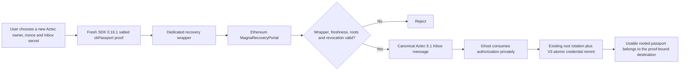

# Magna Passport Recovery V3 Specification

Status: Implementation in progress; Gate A passed on 2026-08-23; Gate B-dev passed on 2026-08-26 and its final clean-deployment L2 consumption run passed on 2026-08-28 with an official live zkPassport developer proof, recursive wrapper, generated EVM verifier, private/EVM mutation rejection, replay rejection, canonical Inbox authorization, Ghost-owned issuer execution, complete destination note discovery, and chain-derived active status; Gate B-production remains open
Protocol target: Aztec `5.1.0`
Compatibility: Clean replacement; Magna has never been deployed, so no legacy recovery path is retained
Primary objective: Recover a Magna root using the passport and a destination wallet without making Magna's backend a recovery authority or availability dependency

## 1. Normative language and evidence standard

The words **MUST**, **MUST NOT**, **SHOULD**, and **MAY** are normative.

This protocol protects long-lived identity state. A passing implementation therefore requires evidence from the real protocol stack:

- An official zkPassport developer-environment flow using its mock-passport facility MAY satisfy Gate B-dev only when SDK `0.16.1` and the zkPassport application generate an actual cryptographic proof that is recursively verified, wrapped, and verified by a deployed Solidity verifier. This is a real proof over simulated identity inputs, not a fabricated proof.
- A developer proof, mock passport, or mock nullifier MUST NOT satisfy Gate B-production or any production release criterion.
- No hand-built public-input array, fixture proof, synthetic witness, locally forged mock proof, or verifier bypass may stand in for a proof produced by the unmodified zkPassport SDK and application in either Gate B profile.
- No mocked Inbox, direct database/tree insertion, TXE message helper, or manually injected witness may satisfy the Aztec end-to-end gate.
- No locally substituted hash or serializer may stand in for the Aztec `5.1.0` Inbox and `aztec.nr` implementations.
- Unit tests may use local mocks only as supplementary tests. Their output MUST be labelled as simulated and cannot be used as Gate B evidence. This restriction does not reclassify the official zkPassport developer flow described above as a local mock.
- A blocked or failed spike is an acceptable result. Missing evidence MUST NOT be converted into a passing result through fixtures, skipped verification, patched dependencies, or weaker modes.
- Every passing spike MUST retain exact dependency versions, source commit hashes, non-sensitive generated artifacts, verification keys, verifier bytecode, transaction hashes, redacted logs, and a reproducible command sequence. A real zkPassport proof contains its scoped identifier in public input `10`: its raw artifact MUST remain encrypted and under the document holder's control, MUST NOT be committed or uploaded, and may be represented in retained evidence only by a cryptographic hash and redacted structural metadata.

The existing six-month-old recovery note transition MUST NOT be modified until Gate A and Gate B-dev pass in isolated spikes. Both gates have passed. V3 implementation may therefore compose the audited root-rotation helper behind the new Inbox boundary, but V3 MUST NOT be declared production-ready until Gate B-production also passes.

## 2. Security model

Recovery has two independent responsibilities:

```text
proof-derived Ghost capability         opens the root recovery note
fresh destination-bound passport proof identifies the root and authorizes its destination now
```

Neither component is sufficient by itself.

The protocol MUST ensure:

- Learning `oprf_value` and reconstructing the Ghost cannot redirect recovery without a fresh passport proof bound to the attacker's destination.
- A passport proof cannot be redirected to a destination, root, deployment, nonce, Inbox secret hash, claims set, or credential expiry different from the values authenticated or deterministically derived by the recovery wrapper.
- A wrapper proof and its resulting Inbox authorization cannot be replayed.
- The Ethereum portal, relayer, Magna backend, and orchestrator cannot alter the authorized destination.
- Magna backend downtime does not prevent a user from submitting and completing recovery.
- The raw scoped identifier (production OPRF or developer non-salted mock), Ghost signing key, passport data, and private recovery note are never sent to Magna's backend or published on Ethereum.
- Recovery introduces no additional user-held recovery key.

The unavoidable availability dependencies are the user's zkPassport flow, Ethereum, Aztec/PXE, the canonical Aztec Inbox, and zkPassport registry services. Production proof generation additionally depends on zkPassport's OPRF service; the isolated non-salted developer profile does not.

### 2.1 Closure argument for the leaked-OPRF/Ghost takeover

Assume the strongest version of the reviewer's attack: an adversary learns `oprf_value`, derives the exact V3 root and Ghost keys, discovers the Ghost-owned recovery note, and can submit transactions on both chains.

The adversary still cannot redirect recovery:

1. `recovery_intent` is fixed in the zkPassport request before proof generation and contains the destination, deployment, nonce, and Inbox secret hash.
2. The outer proof authenticates the canonical Bind bytes for that exact intent.
3. The wrapper derives the root from the outer proof's authenticated OPRF value and combines it with the authenticated intent plus deterministically derived claims and expiry.
4. Changing the destination, nonce, secret hash, root, claims, or expiry therefore changes the final Inbox content. The attacker cannot create a valid wrapper proof for the changed content from the holder's outer proof.
5. The portal takes the Inbox secret hash from the verified wrapper outputs, so a relayer has no mutable authorization field.
6. Aztec independently requires both the exact Inbox message and ownership of the root recovery note. Consuming the holder's unchanged authorization can mint only to the holder-bound destination.

Therefore:

```text
leaked OPRF/Ghost without fresh destination-bound proof  -> reject: no authorized Inbox message
fresh bound proof without Ghost-owned recovery note      -> reject: note cannot be spent
copied valid proof/message                               -> fixed destination only; replay rejected
both components held by the legitimate passport holder  -> recover
```

This argument does not rely on the OPRF value remaining secret from Magna or another same-scope verifier. OPRF secrecy remains privacy defense-in-depth; destination authorization comes from the fresh authenticated Bind predicate.

## 3. Architecture



Ethereum is the authorization snapshot layer because zkPassport's Root Registry is authoritative there. Aztec receives the exact accepted recovery authorization, not a periodically mirrored registry root.

The V3 design intentionally does **not** use:

- a Magna-signed recovery authorization;
- an orchestrator-written authorization map;
- a backend-generated nonce;
- a one-hour registry-root attestation bridged separately to Aztec;
- recursive zkPassport verification inside the production Aztec recovery call.

## 4. Version baseline

All Aztec L2 application and transport components in the integration spike and final implementation MUST use the same exact release:

```text
Aztec CLI                  5.1.0
Aztec.nr dependencies      v5.1.0
@aztec/* L2 app packages   5.1.0
```

The zkPassport recursive-proof lane is a separate frozen toolchain because SDK `0.16.1` and its circuits were released against BB `5.0.0`. The wrapper is proved for EVM verification and is not an Aztec L2 contract:

```text
@zkpassport/sdk            0.16.1
@zkpassport/utils          0.37.3
@zkpassport/registry       0.14.0
@aztec/bb.js               5.0.0
@noir-lang/noir_js         1.0.0-beta.22
zkPassport Noir circuits   bb-v5.0.0
production identifier type SALTED (= 1), never a mock type
developer test identifier  NON_SALTED_MOCK (= 2); dev-only
production FaceMatch       strict
developer FaceMatch        regular; official mock-passport portrait, no liveness
production OPRF key ID     1 (frozen V3 protocol constant)
developer OPRF key         none; outer oprf_pk_hash = 0
inner proof mode           compressed (recursive input to the Magna wrapper)
wrapper output mode        EVM-verifiable proof generated from the finalized Magna wrapper
```

The two lanes MUST remain dependency-isolated. The zkPassport wrapper stack MUST NOT be deduplicated or coerced to Aztec/BB `5.1.0`, and the Aztec L2 stack MUST NOT be downgraded to the wrapper's `5.0.0` proving dependencies. Their shared field encodings and Poseidon2 authorization value MUST be connected only through reviewed TypeScript/Noir/Solidity golden vectors and the Gate A/Gate B end-to-end evidence.

Migration status (2026-08-24): the undeployed Magna workspace, including every Aztec.nr contract, generated binding, application, wallet, e2e package, CLI script, and `.aztecrc`, now targets Aztec `5.1.0`; `apps/magna-management` uses zkPassport SDK `0.16.1`. The only retained `5.0.0` entries are the dependency-isolated zkPassport proof lane listed above. The official zkPassport circuits repository currently publishes only the `bb-v5.0.0` compatibility tag, so this is an upstream proof-format requirement rather than a Magna legacy deployment path.

### 4.1 Deployment profiles

The developer profile MUST first be assembled, inspected, and tested manually. Dockerization occurs only after the complete manual flow passes; it packages the proven flow and is not used to discover or conceal integration behavior:

| Property | Local development (manual first, Docker after pass) | Production |
| --- | --- | --- |
| SDK request | `devMode=true` | `devMode=false` |
| Passport input | Official zkPassport mock-passport facility | Real supported document |
| Nullifier constraint | `NON_SALTED_MOCK = 2` | `SALTED = 1` |
| OPRF constraint | no OPRF request; `oprf_pk_hash = 0` | key ID `1`; pinned non-zero key hash |
| FaceMatch query | `regular` | `strict` |
| Registry trust | Pinned official zkPassport local registry/verifier stack on the shared Anvil | Official Ethereum mainnet registry context |
| Wrapper/verifier | Developer-only artifact and address | Production-only artifact and address |
| Gate satisfied | Gate B-dev | Gate B-production |

The deployment profile MUST be explicit and fail closed. Both manual and later Dockerized development MUST select only the developer wrapper/verifier and developer registry context. Production MUST refuse to start when `devMode=true`, when a developer verifier/VK is configured, or when the configured registry chain is not the frozen production chain. Changing a hostname, image tag, build mode, or RPC URL MUST NOT silently promote a developer deployment into production.

The current A2 code implements this profile split. `apps/magna-management` requests `NON_SALTED` without an `oprfKeyId` and selects `regular` FaceMatch only for `devMode=true`; its local witness records the selected proof profile. The official ZKR proof converts that request into authenticated `NON_SALTED_MOCK = 2` with `oprf_pk_hash = 0`. The TypeScript witness builder and developer Noir wrapper pin those values, while production pins `SALTED = 1`, OPRF key ID `1`, its published key hash, and strict FaceMatch. The verification API selects the matching hash-pinned circuit artifact from `MAGNA_ZKPASSPORT_DEV_MODE` and independently enforces the matching nullifier/OPRF pair. The production Noir source and artifact remain separate and unchanged. Gate B-dev satisfied this profile on 2026-08-26 with a genuine proof from the official developer application and the complete wrapper/EVM/canonical-Inbox authorization path.

The committed generic A2 wrapper bundles are pinned independently:

```text
production wrapper SHA-256  a7093ad57c0a5cfcb073134d7ed0907067e9b253b11f929fd84b4a321179cea7
developer wrapper SHA-256   b952eb6435ac847e6dc87e5400b5e81703c2537629b56bab1a550a4561eca4c4
```

The local developer target MUST run on one shared external Anvil with chain ID `31337`. zkPassport's pinned official source provides this local profile directly: registry SDK `0.14.0` defines chain `31337`, Root Registry `0x5FbDB2315678afecb367f032d93F642f64180aa3`, and Registry Helper `0xe7f1725E7734CE288F8367e1Bb143E90bb3F0512`; its official test scripts deploy the Root Registry, Certificate/Circuit/Sanctions registries, seed registry history and revocations, and deploy the real RootVerifier, SubVerifier, VerifierHelper, and outer proof verifiers. Aztec `5.1.0` can then deploy its local L1 stack and start its local rollup against that same Anvil RPC. This exact coexistence was exercised successfully from the pinned sources on 2026-08-24: the Aztec node reported L1 chain ID `31337` and a live canonical Inbox while bytecode for the zkPassport Root Registry and RootVerifier remained present on the same EVM.

Before Docker work begins, the operator MUST execute each startup, deployment, seeding, proof-generation, verification, portal, Inbox, and private-consumption step manually; inspect the resulting addresses, bytecode hashes, public inputs, roots, events, message leaf, and nullifiers; and run the required positive and negative tests. The retained manual evidence and exact commands become the Docker contract.

Only after that manual combined test passes MAY the repository add a Docker launcher. The launcher MUST reproduce the frozen manual commands, start one Anvil itself, and point both stacks at it. It MUST NOT use the Aztec shell wrapper in a way that silently creates a second empty Anvil; the pinned `5.1.0` wrapper unconditionally spawns Anvil when its first argument is `start --local-network`. Dockerization MUST NOT change verifier artifacts, registry seeds, deployment order, addresses, trust-context inputs, proof modes, or test expectations. A clean Docker run MUST repeat the same acceptance suite before Docker support is declared complete.

The local registry is a developer trust anchor, not a claim that chain `31337` is authoritative production state. To prevent a circular test, Gate B-dev MUST derive the accepted certificate and circuit roots independently from the pinned official zkPassport packages/manifests and seed them through the unmodified official registry contracts before examining whether the candidate proof passes. It MUST retain those derivation inputs and hashes as evidence. Seeding roots copied only from the proof under test, changing registry storage with Anvil cheat codes, accepting every root, patching a verifier, using a verifier stub, or manually injecting an authorization fails Gate B-dev. Gate B-dev MUST also prove that an unseeded root and an explicitly revoked seeded root are rejected.

The transaction-driven local Aztec network does not create checkpoints while a
client merely polls for an Inbox witness. The chain-31337 launcher MUST pin the
empirically validated Aztec 5.1 timing profile: `ETHEREUM_SLOT_DURATION=4`,
`AZTEC_SLOT_DURATION=8`, and `SEQ_BLOCK_DURATION_MS=1000`. Aztec's local
`AutomineSequencer` assigns each rapid transaction or debug checkpoint to a fresh
slot; the production-sized 72-second default therefore accumulates future L1
time and can falsely age a fresh passport proof past the portal's one-hour limit.
After the real portal transaction is mined, the Gate B-dev client MAY use the
official `aztecDebug_warpL2TimeAtLeastTo` operation to build empty checkpoints,
but only after independently confirming that both the Aztec node and L1 RPC
report chain `31337`. Before every advance it MUST wait until wall time is
strictly later than the latest monotonic L1 block timestamp, then use that wall
timestamp as the next minimum target. It MUST fail rather than add a checkpoint
when pre-existing drift is at or above 180 seconds. It MUST resolve the canonical
Inbox address from Aztec node info, read that contract's live `LAG()`, bound the
number of checkpoint advances from that value, and still require the exact
portal-emitted leaf and global index from the normal Aztec membership API. This
local liveness operation MUST NOT exist in production/testnet execution and MUST
NOT inject a message or witness directly.

The unmodified SDK `0.16.1` still selects Sepolia for its own `devMode=true` registry check, and the official zkPassport application still participates in live developer-proof generation. Therefore this profile removes every public-chain deployment and transaction dependency, but it is not an air-gapped zkPassport simulator. A read-only Sepolia cross-check by the SDK and network access to zkPassport proof resources may occur during proof generation; neither is a recovery authority inside Magna's local stack. The non-salted developer request does not generate OPRF authorization proofs or call the TACEO evaluation service. A fully offline replay MAY use a previously generated encrypted artifact only as supplementary reproducibility evidence and MUST NOT replace the live official proof required by Gate B-dev.

The following values are frozen V3 protocol constants. They match the installed official SDK `0.16.1` / utils `0.37.3` packages and Magna's existing A2 TypeScript and Noir constraints:

```text
outer circuit name         outer_count_7
outer circuit version      0.20.0
outer public-input count   12
outer VK hash              0x19d93a8a69386b80903a8559d884bea729dc1ecc1db48afc6d3bb73d4ed3abbe
OPRF public-key hash        1178201404428554206520802247552222388413553631367032661928167491793274360628
OPRF public-key x           18166959201346800007624274454748264099569154910741994195889360204497718998925
OPRF public-key y           17198643698593566948834308934687875815952052155871236424838876937611092999400
scoped identity input index 10 (production OPRF; developer non-salted mock)
OPRF key hash input index   11
nullifier type input index  9
proof current-date index    2
Ethereum mainnet Root Registry
                            0x1D0000020038d6E40E1d98e09fA1bb3A7DAA8B70
Ethereum mainnet Registry Helper
                            0x8C93bB3a7ED88dA0647Ea53f8cd3f57832a513Cd
certificate registry ID     1
circuit registry ID         2
```

The production artifact in section 16.3 MUST match these values. Gate B-dev MUST match the frozen circuit, version, VK, public-input layout, non-salted query, zero OPRF-key-hash field, and Bind encoding documented for the developer profile. A mismatch fails the relevant gate; code and documentation MUST NOT be adjusted merely to make a different artifact pass. Supporting a different production SDK, outer circuit, VK, public-input layout, nullifier type, or OPRF key requires a new explicitly versioned Magna recovery protocol.

## 5. Recovery identity derivation

V3 is a clean protocol replacement, but it MUST locate the root and Ghost already created by the current rooted A2 issuance circuit. This is not a backward-compatibility branch: A2 issuance and V3 recovery are one identity protocol. A second V3-only root namespace would make every issued `RootRecoveryNote` unreachable.

```text
MAGNA_GHOST_DS            = 0x4D414748  // "MAGH", exact rooted A2 domain
MAGNA_ROOT_DS             = 0x4D414749  // "MAGI", exact rooted A2 domain
MAGNA_RECOVERY_INTENT_V3_DS=0x4D524933  // "MRI3"
MAGNA_RECOVERY_AUTH_V3_DS = 0x4D524133  // "MRA3"
MAGNA_RECOVERY_BLIND_V3_DS= 0x4D524233  // "MRB3"
MAGNA_RECOVERY_TRUST_V3_DS= 0x4D525433  // "MRT3"
```

Identity input:

```text
credential_type = 1
identity_value
```

`identity_value` is always authenticated outer public input `10`. In production it is the scoped salted OPRF identifier. In the isolated developer profile it is the official ZKR non-salted mock identifier. This abstraction changes no production derivation or trust assumption; it only lets both explicitly separated profiles exercise the same deterministic V3 encoding.

Root commitment:

```text
root_commitment = Poseidon2(
    MAGNA_ROOT_DS,
    [identity_value]
)
```

Ghost signing key:

```text
ghost_signing_seed = Poseidon2(
    MAGNA_GHOST_DS,
    [identity_value, credential_type]
)
```

The exact `Field -> GrumpkinScalar` conversion MUST use the Aztec `5.1.0` account API. A zero or non-convertible scalar is fatal; the client MUST NOT silently move to a different Ghost namespace.

```text
ghost_signing_key   = GrumpkinScalar(ghost_signing_seed)
ghost_privacy_secret= deriveSecretKeyFromSigningKey(ghost_signing_key)
ghost_account_salt  = ghost_signing_seed
```

The browser derives and imports the account with the exact Aztec `5.1.0` Schnorr APIs. Before submitting to the portal, it MUST compare the wrapper-derived root and locally derived Ghost address with the selected rooted A2 credential. A mismatch is fatal. Deployment separation remains in `recovery_intent`; it MUST NOT be added to root/Ghost lookup and thereby fork issuance identity.

## 6. Destination-bound recovery intent and authorization

### 6.1 Pre-proof recovery intent

SDK `0.16.1` serializes the complete query, including Bind data, into the request URL before the holder generates any proof. The SDK extracts the selected scoped identifier from the completed outer proof and returns it only during proof verification/`onResult`. The Bind value therefore MUST NOT depend on `identity_value`, `root_commitment`, authenticated passport disclosures, or any value derived from them. Requiring such a value would create an impossible one-request cycle.

Before asking zkPassport to generate a proof, the recovery client creates only values it already knows:

```text
destination          = user's new active-owner Aztec address
recovery_nonce       = cryptographically random non-zero BN254 Field
message_secret       = cryptographically random non-zero BN254 Field
message_secret_hash  = Aztec 5.1 compute_secret_hash([message_secret])
```

The client computes:

```text
recovery_intent = Poseidon2(
    MAGNA_RECOVERY_INTENT_V3_DS,
    [
        3,
        ethereum_chain_id,
        recovery_portal_l1_address,
        aztec_protocol_version,
        aztec_chain_id,
        issuer_l2_address,
        destination,
        recovery_nonce,
        message_secret_hash
    ]
)
```

All address-to-field conversions, secret hashing, and Poseidon2 calls MUST have Solidity/TypeScript/Noir golden vectors.

### 6.2 Post-proof recovery authorization

After recursively verifying the outer proof, the dedicated profile-specific wrapper obtains the authenticated `identity_value`, derives `root_commitment`, derives the committed passport claims, and computes the credential expiry. It then computes:

```text
recovery_authorization = Poseidon2(
    MAGNA_RECOVERY_AUTH_V3_DS,
    [
        3,
        recovery_intent,
        root_commitment,
        claims_hash,
        credential_valid_until
    ]
)
```

The wrapper MUST derive the claim blinds deterministically so a party holding the outer proof cannot choose a different valid commitment for the same passport:

```text
nationality_blind = Poseidon2(MAGNA_RECOVERY_BLIND_V3_DS, [3, identity_value, recovery_nonce, 1])
expiry_blind      = Poseidon2(MAGNA_RECOVERY_BLIND_V3_DS, [3, identity_value, recovery_nonce, 2])
```

`claims_hash` MUST then use Magna's existing committed-passport claim formula with the authenticated nationality, authenticated age lower bound, authenticated passport expiry, and those two blinds. `credential_valid_until` MUST equal the earlier of authenticated passport expiry and `proof_current_date + 30 days`; it is not a prover-selected value. The client can reproduce and retain the claim witness locally from the authenticated identity value and nonce.

`recovery_authorization` MUST be a valid BN254 field because it becomes the Inbox message `content`. The Ghost address is deliberately not inside this hash: possession of the Ghost-owned `RootRecoveryNote` is checked independently by the private Aztec transition, while the wrapper-derived root binds the message to the exact recoverable lineage.

There is no backend nonce and no separate ten-minute authorization deadline. Passport proof freshness is decided on Ethereum. Credential expiry remains an independent credential rule, described in section 13.

## 7. zkPassport Bind predicate

The fresh zkPassport query MUST authenticate the pre-proof `recovery_intent` through a Bind predicate whose `custom_data` is exactly:

```text
magna-recovery-v3:<64 lowercase hexadecimal characters>
```

The hexadecimal component is the zero-padded 32-byte representation of `recovery_intent`. The wrapper MUST recompute the intent from the private destination and nonce plus the public `message_secret_hash`, reproduce the exact SDK `formatBoundData` byte encoding, and authenticate its parameter commitment against the recursively verified outer proof.

An unconstrained string, post-proof destination hash, or wrapper-only binding is invalid: a party that learns the outer proof and scoped identifier could otherwise create a new wrapper for another destination. Binding the post-proof `recovery_authorization` is also invalid because its root and claims do not exist until after the request has already been fixed.

## 8. Dedicated recovery wrapper

Recovery MUST use a dedicated circuit, `magna_passport_recovery_v3`. The generic A2 issuance/renewal wrapper remains unchanged unless a separate compatibility test proves a shared modification safe.

The recovery wrapper MUST:

1. Recursively verify the exact real zkPassport outer proof and pin its VK hash and proof type.
2. Require `SALTED = 1` in the production build. The isolated Gate B-dev build MUST instead require only `NON_SALTED_MOCK = 2`; neither build may accept both.
3. Pin the verified production OPRF public-key hash. The developer build MUST require the authenticated `oprf_pk_hash` field to equal `0`.
4. Authenticate the expected service domain, scope, and subscope.
5. Authenticate certificate and circuit registry roots from the outer proof.
6. Require strict FaceMatch in the production build. The isolated Gate B-dev build MUST instead require regular FaceMatch. Both builds MUST require the official application attestation environment and authenticate the exact parameter commitment.
7. Authenticate required disclosure, age, document, nationality, and expiry predicates.
8. Derive `root_commitment` from outer public input `10`, whose production meaning is the authenticated OPRF value and whose developer meaning is the authenticated non-salted mock identifier.
9. Recompute and authenticate `recovery_intent` from destination, nonce, and `message_secret_hash` exactly as in sections 6.1 and 7.
10. Derive the claims blinds, `claims_hash`, and `credential_valid_until` exactly as in section 6.2.
11. Compute `recovery_authorization` from the authenticated intent, derived root, derived claims, and derived expiry.
12. Expose only the public outputs required by the Ethereum portal.

Public outputs:

```text
0  schema                    = 3
1  recovery_authorization
2  message_secret_hash
3  proof_current_date
4  certificate_registry_root
5  circuit_registry_root
6  trust_context_hash
```

Private wrapper inputs include the outer proof material, `destination`, and `recovery_nonce`. The wrapper derives rather than accepts `root_commitment`, the claim blinds, `claims_hash`, and `credential_valid_until`. Ethereum sees the authorization commitment, Inbox secret hash, and registry context, but not the destination, nonce, root, claims, scoped identifier, or passport data.

```text
trust_context_hash = Poseidon2(
    MAGNA_RECOVERY_TRUST_V3_DS,
    [
        3,
        ethereum_chain_id,
        recovery_portal_l1_address,
        aztec_protocol_version,
        aztec_chain_id,
        issuer_l2_address,
        service_scope_hash,
        service_subscope_hash,
        nullifier_type,
        oprf_public_key_hash,
        recovery_wrapper_version
    ]
)
```

These are the two authenticated fields that zkPassport actually places in the outer proof; no third free-form string encoding is invented. Matching official SDK `0.16.1`, utils `0.37.3`, and `SubVerifier.sol`:

```text
service_scope_hash    = SHA-256(UTF-8 service domain) >> 8
service_subscope_hash = SHA-256(UTF-8 SDK request scope) >> 8, or 0 when absent
```

The wrapper MUST require outer public inputs `3` and `4` to equal these frozen expected field values. TypeScript MUST derive them through the official `getServiceScopeHash` and `getServiceSubscopeHash` utilities; Solidity's reference semantics are `sha256(abi.encodePacked(value)) >> 8`.

The finalized artifact MUST produce a new VK and generated Solidity verifier. Neither may be guessed or copied from A2.

## 9. Ethereum `MagnaRecoveryPortal`

The portal is a small permissionless transport and verification contract. Conceptually:

```solidity
authorizeRecovery(
    uint256 proofVersion,
    bytes wrapperProof,
    uint256[7] publicInputs
)
```

It MUST:

1. Select an approved, versioned recovery-wrapper verifier.
2. Verify the wrapper proof and exact seven public inputs.
3. Require schema `3` and the immutable expected `trust_context_hash`.
4. Require `block.timestamp >= proof_current_date`.
5. Require `proof_current_date + RECOVERY_PROOF_MAX_AGE > block.timestamp`.
6. Validate both roots against the official zkPassport Root Registry using `isRootValid(registryId, root, proof_current_date)`, matching the pinned `SubVerifier` call exactly.
7. Reject roots whose current registry record is revoked or whose configured validation mode rejects them for `proof_current_date`. The registry read occurs at portal execution time even though the validity query's timestamp argument is the authenticated proof timestamp.
8. Reject an already accepted `recovery_authorization`.
9. Call the configured Aztec `5.1.0` Inbox with the issuer as recipient, the authorization as content, and the wrapper-authenticated `message_secret_hash` at public-input index `2`.
10. Record the authorization as accepted only if the Inbox call succeeds.
11. Emit the authorization, authenticated secret hash, Inbox leaf, global leaf index, proof version, and source block for discovery.

The portal MUST NOT accept a separate caller-selected secret hash. Otherwise a relayer could replace the holder's Inbox secret hash after proof generation and prevent the holder from consuming the authorization.

Baseline timing constants:

```text
RECOVERY_PROOF_MAX_AGE = 1 hour
```

This is Magna's recovery policy, not the zkPassport SDK's seven-day default validity and not a login frequency. The strict inequalities intentionally match the official `DateUtils.isDateValid(timestamp, validityPeriodInSeconds)` semantics; the portal MUST NOT invent a future-clock-skew allowance. Any later change MUST be a reviewed portal version/configuration change with explicit tests.

The portal MUST pin or version:

- the Ethereum chain ID;
- official zkPassport Root Registry address and registry identifiers;
- recovery-wrapper verifier and version;
- Aztec Inbox address;
- Magna issuer L2 actor and Aztec protocol version;
- expected trust context.

Deployment MUST resolve the portal-address self-binding without guessing. The deployment script MUST precompute the next ordinary Ethereum `CREATE` address from a frozen deployer and nonce, compute `trust_context_hash` with that address, deploy the portal with the hash, and assert the deployed address. `CREATE2` MUST NOT be used for this V3 constructor because its address depends on init code containing `expectedTrustContextHash`, producing a circular calculation.

## 10. Authorization snapshot and revocation semantics

Recovery validity is evaluated when the Ethereum portal accepts the request.

```text
revocation before portal transaction  -> portal rejects
portal acceptance before revocation   -> accepted Inbox authorization remains valid
```

Aztec MUST NOT re-evaluate registry roots when consuming the message and MUST NOT apply the former one-hour mirrored-root TTL. Cross-chain settlement delay does not reinterpret an authorization that was valid at its source-chain block.

This does not make old passport proofs reusable. A user who initiates recovery months or years later creates a new proof, and the portal applies the current registry state at that time.

## 11. Exact Aztec `5.1.0` Inbox contract

The portal calls the canonical `Inbox.sendL2Message`:

```solidity
sendL2Message(
    L2Actor({ actor: bytes32(issuer_l2_address), version: aztec_protocol_version }),
    bytes32(recovery_authorization),
    bytes32(message_secret_hash)
)
```

`message_secret_hash` MUST be the wrapper-authenticated public output and MUST be produced using Aztec `5.1.0`'s:

```noir
compute_secret_hash([message_secret])
```

It is Poseidon2 with `DOM_SEP__SECRET_HASH`; it is not SHA-256 and not an application-defined hash.

The canonical Inbox constructs the leaf from:

```text
sender       = MagnaRecoveryPortal (`msg.sender` at Inbox)
chain_id     = Ethereum `block.chainid`
recipient    = Magna issuer L2 address
version      = Inbox/Aztec protocol version
content      = recovery_authorization
secret_hash  = message_secret_hash = compute_secret_hash([message_secret])
leaf_index   = Inbox global leaf index
```

Aztec `5.1.0` serializes those seven values as 32-byte big-endian fields in that order and applies its canonical SHA-256-to-field operation. Application code MUST NOT calculate a different leaf format.

## 12. Aztec issuer changes

Remove these production surfaces completely:

```text
root_recovery_authorizations
authorize_root_recovery(...)
compute_root_recovery_authorization_hash(...)
POST /zkpassport/verify-for-root-recovery as an authority
generic rootless recover(...)
RecoveryNote and rootless passport issuance
```

The orchestrator remains relevant to local issuance and administrative testing, but has no V3 recovery authority.

Preserve:

- `RootRecoveryNote` and its private discovery;
- Ghost account authorization through `msg_sender()`;
- root lineage and revocation nullifiers;
- the audited private transition inside `recover_root_for_caller()`;
- normal issuance, renewal, verification, and login behavior.

### 12.1 Existing transition boundary

The current `recover_root_for_caller()` is intentionally a minimal root-rotation primitive. It:

1. proves and nullifies the settled Ghost-owned `RootRecoveryNote`;
2. emits the prior root kill-switch nullifier;
3. creates a fresh root revocation secret;
4. mints a fresh `RootStatusNote` to the destination; and
5. mints a fresh `RootRecoveryNote` back to the calling Ghost.

It does **not** mint a `RootAuthorityNote`, `LinkedCredentialNote`, `LinkedStatusNote`, or `LinkedRecoveryNote`. The current application therefore marks the result `recovery_pending`, and the existing end-to-end test separately invokes `register_root_authority()` and `register_linked_credential()` before linked verification becomes usable again.

V3 MUST preserve that audited helper exactly for the root kill/rotation portion, but the new external V3 entrypoint MUST complete the already-existing rooted issuance composition atomically after the helper returns. This avoids a backend-dependent `recovery_pending` state without pretending that the old helper already performs credential reissuance.

Conceptual private entrypoint:

```rust
#[external("private")]
fn recover_root_v3(
    hinted_root_recovery: HintedNote<RootRecoveryNote>,
    destination: AztecAddress,
    recovery_nonce: Field,
    claims_hash: Field,
    credential_valid_until: u64,
    message_secret: Field,
    message_leaf_index: Field,
)
```

It MUST:

1. Set `ghost_owner = self.msg_sender()` and validate the destination address.
2. Read `root_commitment` from the Ghost-owned recovery note.
3. Recompute `message_secret_hash`, `recovery_intent`, and `recovery_authorization` exactly as in section 6. The caller-supplied `claims_hash` and `credential_valid_until` are safe only because changing either changes the Inbox content and therefore fails message membership.
4. Consume the canonical message with:

   ```noir
   self.context.consume_l1_to_l2_message(
       recovery_authorization,
       [message_secret],
       configured_portal_eth_address,
       message_leaf_index,
   );
   ```

5. Require `claims_hash != 0` and `credential_valid_until > anchor_timestamp` before minting the recovered credential.
6. Call the existing `recover_root_for_caller()` transition to nullify the old recovery note, kill the prior root state, mint the fresh destination-owned `RootStatusNote`, and re-arm the Ghost-owned `RootRecoveryNote`.
7. Generate a fresh authority revocation secret and call the existing `mint_root_authority_note()` for `destination`, `root_commitment`, `claims_hash`, and `credential_valid_until`.
8. Generate a separate fresh linked revocation secret and call the existing `mint_linked_credential_notes()` for `destination`, `ghost_owner`, `root_commitment`, `claims_hash`, passport credential type `1`, and `credential_valid_until`.

The resulting atomic note set MUST be identical in shape to rooted passport issuance:

```text
destination owns  RootStatusNote
destination owns  RootAuthorityNote
destination owns  LinkedCredentialNote(type = passport)
destination owns  LinkedStatusNote(type = passport)
Ghost owns        RootRecoveryNote
Ghost owns        LinkedRecoveryNote(type = passport)
```

The old root authority and linked notes are not individually spent. They remain unusable because linked verification requires an unrevoked owner-matched root status, and the old root status's kill-switch nullifier is emitted by `recover_root_for_caller()`. The new notes use fresh root, authority, and linked revocation secrets.

Inbox consumption emits the protocol message nullifier and prevents reuse. No second application replay map is required unless the exact `5.1.0` spike disproves this behavior.

There is no separate L2 passport-proof or registry-attestation deadline. The `credential_valid_until` check prevents minting an already expired credential; it is not a reinterpretation of the Ethereum authorization snapshot. If an accepted authorization remains unconsumed until its deterministically derived credential expiry, the user generates a new recovery proof, nonce, and Inbox secret.

## 13. The three clocks

```text
zkPassport recovery proof freshness  1 hour at Ethereum portal submission
Magna credential validity            maximum 30 days under current policy
login/session assertion              short-lived and generated per login
```

The one-hour proof rule does **not** require hourly passport scans. It applies only when submitting a newly generated proof for issuance, renewal, or recovery. Normal login uses the private credential already stored in the Aztec wallet.

A user may initiate recovery after a year or many years by generating a fresh proof from the same supported identity document under the frozen V3 domain, scope, subscope, and OPRF key. A renewed or replacement document is not assumed to be the same zkPassport ID; that is an explicit product boundary, not an unresolved implementation question.

## 14. Client and relayer flow

1. Create or select the destination Aztec account. Before any recovery authorization is consumed, register and retain it as a secondary wallet-owned account in the active PXE so destination-owned notes can be decrypted and queried after recovery. This does not make the destination sign or authorize recovery and does not switch the active wallet session.
   Newly created passkeys MUST use a user-visible, editable wallet name that distinguishes the recovery destination from older credentials in the platform passkey chooser. A website cannot rename an existing WebAuthn credential after registration.
2. Generate `recovery_nonce` and `message_secret` locally with a CSPRNG.
3. Derive `message_secret_hash` and `recovery_intent` with the exact Aztec `5.1.0` and V3 implementations.
4. Complete a fresh SDK `0.16.1` salted query whose Bind predicate authenticates the pre-proof recovery intent. Use strict FaceMatch for production or regular FaceMatch only in the explicit developer profile.
5. Confirm locally that the SDK-returned scoped identifier equals authenticated outer public input `10` before deriving V3 state. Production additionally confirms `SALTED = 1` and the pinned OPRF-key hash; development confirms `NON_SALTED_MOCK = 2` and a zero OPRF-key-hash field.
6. Locally derive the V3 Ghost and claim witness, then generate the dedicated recovery-wrapper proof. Confirm that its public secret hash equals the locally computed value.
7. Submit the same portal call directly, through Magna's relayer, or through any third-party relayer.
8. Wait for the canonical Inbox message to be included in Aztec and obtain its global leaf index/witness through supported APIs.
9. Import the transient Ghost account locally and discover its `RootRecoveryNote`.
   In the chain-31337 developer profile only, the client MAY fund the Ghost through the canonical Fee Juice portal using the disposable local Anvil faucet key. The client MUST perform the L1→L2 bridge and claim directly, MUST refuse non-local chains, and MUST NOT depend on the Magna API. Production recovery MUST use the reviewed production fee/sponsorship path and MUST NOT embed a faucet key.
10. Before calling the irreversible L2 transition, persist a crash-resume finalization record containing only the destination profile, source credential reference, authenticated root/claims/expiry, and the destination's committed-claims witness. It MUST NOT contain the scoped identifier, Ghost keys, raw proof, proof witness, recovery nonce, or Inbox message secret.
11. Call `recover_root_v3` from the Ghost and, after settlement, add the transaction hash to the finalization record.
12. Dispose of the Ghost wallet, proof worker, scoped-identifier material, and message secret.
13. Discover the complete usable rooted passport note set from the destination and Ghost wallets. Destination-side private hint simulation MUST execute from an account actually registered in the wallet/PXE; treating an arbitrary address as an owned account is invalid.
14. Mark the recovered credential active and remove the finalization record only after the complete note set is available. If discovery or the browser fails after step 11, resume destination finalization from the stored non-secret record; do not blindly replay the already-consumed authorization. `recovery_pending` is an internal resumable state, not a successful V3 terminal state.

Magna's backend MAY sponsor gas and report status. It MUST NOT generate the nonce, receive the scoped identifier, rewrite the call, or be the only submission route. A documented raw portal interface and reproducible alternative client MUST exist before production.

## 15. Browser secret policy

JavaScript cannot guarantee physical memory erasure. The implementation MUST nevertheless minimize application-lifetime exposure:

- Use a dedicated recovery origin or isolated page realm without analytics, tag managers, ads, or unrelated third-party scripts.
- Keep OPRF and Ghost derivation in a dedicated Worker where supported.
- Never place OPRF, proof witnesses, or Ghost secrets in URLs, logs, telemetry, crash reports, React/global state, IndexedDB, local storage, or session storage.
- Never include them in a Magna API payload.
- Clear mutable buffers where possible, terminate workers, and dispose PXE/Ghost sessions in `finally` blocks.
- Serve the recovery application and responses with `Cache-Control: no-store`.

This is a best-effort exposure reduction, not a false guarantee of garbage-collected memory erasure.

## 16. Mandatory engineering and release gates

### 16.1 Gate A: real Aztec `5.1.0` Inbox end-to-end — PASSED 2026-08-23

The isolated spike at `spikes/recovery-v3-aztec-inbox` passed this gate against official Aztec `5.1.0`, source commit `3ffc13a503b7bf321c3578399074938c75f2ac7e`. It used the canonical deployed Inbox, a real Solidity portal transaction, normal L1-to-L2 synchronization, a deployed Noir private consumer, and real client-IVC proofs. Both the portal message and a direct non-portal message entered the canonical message tree; the consumer accepted only the portal message because the portal is pinned in immutable L2 state. Wrong sender, wrong secret, wrong content, replay, and duplicate portal authorization all failed. The official `L1ToL2Message.hash()` reproduced both emitted Inbox leaves exactly. Full addresses, transaction hashes, vectors, artifact hashes, and reproduction commands are in `spikes/recovery-v3-aztec-inbox/evidence/2026-08-23.md`.

The official local-network preset reports `realProofs=false` for rollup epoch proofs. That does not replace or mock the Inbox contract, message tree, private application execution, client-IVC proof, or nullifier tested by this gate; it means this spike does not claim to test production rollup epoch-prover soundness.

The spike MUST prove this path on an actual local Aztec `5.1.0` network with its real L1 contracts:

```text
Solidity portal transaction
  -> deployed canonical Inbox.sendL2Message
  -> real MessageSent leaf and global index
  -> proposer imports the message into Aztec
  -> deployed Noir private function consumes it
  -> protocol message nullifier is included
  -> identical second consumption fails
```

Required assertions and retained evidence:

- The portal is the Inbox-recorded L1 sender.
- Recipient, version, chain ID, content, secret hash, global index, and resulting leaf match both the emitted L1 event and the official Aztec `5.1.0` implementation.
- The Noir call succeeds only with `[message_secret]`, the exact portal address, content, and leaf index.
- Mutating any one component fails.
- A direct Inbox call from another sender cannot authorize recovery.
- Reusing the same leaf/secret fails due to the protocol nullifier.
- Magna API is stopped for the entire successful test.
- The test uses the canonical deployed Inbox and normal proposer synchronization. TXE insertion helpers and manually constructed membership witnesses cannot satisfy this gate.

Pass evidence MUST include the Aztec release/version output, official source commit, L1 portal and Inbox addresses, L2 contract address, transaction hashes, `MessageSent` data, consumed/nullified result, negative-test receipts, and a clean-run script.

### 16.2 Gate B-dev: official zkPassport developer proof through the wrapper and EVM

This gate establishes engineering feasibility without requiring a physical passport. It MUST use zkPassport's official developer environment and mock-passport facility to produce an actual proof through the SDK/application/circuit pipeline:

```text
official zkPassport developer mock passport
  -> SDK 0.16.1 non-salted recovery query with canonical Bind and devMode=true
  -> actual cryptographic outer artifact, VK and authenticated public inputs
  -> isolated developer recovery-wrapper witness and proof
  -> generated developer-only Solidity verifier
  -> successful verification in an actual EVM transaction
```

Required assertions and retained evidence:

- The SDK package is exactly `0.16.1`; the request sets `devMode=true`, explicitly requests `NullifierType.NON_SALTED`, omits `oprfKeyId`, uses `facematch("regular")`, and requests recursive `compressed` proof mode. FaceMatch remains part of Magna's authenticated disclosure policy, but no OPRF authorization proof or TACEO evaluation request is made.
- The proof MUST be produced by the official zkPassport application/mock-passport flow in response to that live request. A checked-in fixture, copied sample, hand-built public-input array, synthetic witness, locally generated substitute proof, patched SDK/circuit, skipped constraint, or verifier stub fails this gate.
- Circuit name/version, proof type, VK hash, public-input count, semantic indices, OPRF-key-hash field, and nullifier type MUST be read from the returned artifact and retained as redacted metadata. The circuit, version, VK, and layout MUST match section 4; the developer OPRF-key-hash field MUST equal `0`.
- The developer artifact's authenticated nullifier type MUST equal `NullifierType.NON_SALTED_MOCK`, SDK `0.16.1` enum value `2`. The official `bb-v5.0.0` scoped-nullifier circuit converts a non-salted proof for issuing country `ZKR` into this type and returns `oprf_pk_hash = 0`. The developer wrapper pins exactly that pair; production remains exactly `SALTED = 1` with key ID `1`.
- Client-side proving MUST initialize Barretenberg with an explicit `2^20` BN254 CRS. Measured from the A2-compatible committed developer artifact with the pinned `@aztec/bb.js` `5.0.0` `acirGetCircuitSizes` API, the developer wrapper has 709,547 gates and a 1,048,576-point dyadic proving domain. The production wrapper's exact count MUST be measured and pinned when that separately isolated circuit is implemented; it MUST NOT be inferred from the developer count. The library's browser default of `2^19` is insufficient. The first client proof MAY download and cache the larger CRS, but it MUST NOT fall back to a Magna-controlled prover service.
- The unmodified SDK verification pass MUST run with `devMode=true`, which selects the Sepolia registry context in SDK `0.16.1`, and record the roots and successful read-only official validation. The subsequent on-chain developer integration MUST independently validate the same authenticated roots through the pinned official local RootRegistry/RootVerifier stack on shared Anvil. A disagreement fails the gate; code or registry state MUST NOT be changed merely to make the candidate artifact pass.
- The Bind bytes in the artifact MUST authenticate the exact pre-proof, destination-bound `recovery_intent`, including the holder-selected Inbox secret hash.
- The new developer wrapper proof MUST be generated from the returned artifact and recursively verify it without skipped constraints or patched verification.
- The developer Solidity verifier MUST be generated from that wrapper VK, deployed to the shared Anvil, and verify through an actual transaction. The local recovery portal MUST then validate the authenticated roots against the already-seeded official local RootRegistry and send the resulting authorization through the canonical local Aztec Inbox.
- Before portal simulation, the runner MUST confirm that the latest shared-Anvil block timestamp is not behind the authenticated proof date. A plain heartbeat transaction is insufficient because it does not coordinate an L2 checkpoint. On local chain `31337` only, the runner MAY make one pre-portal call to Aztec 5.1's official `aztecDebug_warpL2TimeAtLeastTo`, using the authenticated proof timestamp—not browser wall time—as the minimum target. The method atomically advances L1 and builds an empty L2 checkpoint at the next configured slot boundary. The runner MUST first reject an authenticated proof date later than the browser wall clock, MUST re-read L1 after the call, and MUST enforce the portal's exact `age < 3600 seconds` rule against the resulting block before root checks, mutation tests, or portal simulation. It MUST retain the before/after L1 block numbers, timestamps, requested proof-time target, and resulting block hash. This one-time proof-date synchronization is separate from post-portal Inbox checkpoint advancement: every later checkpoint MUST follow the wall-paced, drift-bounded procedure above and MUST NOT request a relative one-second warp, because Automine rounds that request to a complete Aztec slot. If an existing local chain is already outside the freshness window, the runner MUST fail closed with the measured timestamps and require a clean local-network restart and bootstrap; a new proof alone cannot repair a chain that is monotonically ahead of the host. The runner MUST NOT move chain time backwards, rewrite the authenticated proof date, relax the portal policy, call Anvil's raw `evm_setNextBlockTimestamp`, mutate storage, derive a target from a proof date later than wall time, expose this path on a non-local chain, or use another time/state shortcut to make a proof pass. The unmodified portal call MUST then simulate successfully before any EVM mutation rejection is credited.
- Destination, nonce, message secret hash, derived root, derived claims, derived expiry, Bind byte, public input, inner proof, inner VK, wrapper proof, and wrapper VK mutations MUST each fail. For an inner-proof mutation, successful ACVM/Noir witness execution is not acceptance and is not a sufficient negative test: the runner MUST attempt to generate and verify the wrapper proof with Barretenberg, and MUST fail the gate if that mutated witness produces a valid wrapper proof. The mutated inner field MUST be a transcript-bound proof scalar identified from the pinned `bb.js` proof layout, not a pairing-point/aggregation prefix field whose standalone mutation may be semantically irrelevant.
- `compressed-evm` MUST NOT be substituted for the recursive `compressed` inner proof. V3 recursively verifies the inner proof privately and exposes only the dedicated Magna wrapper outputs to Ethereum.

The developer circuit/artifact/VK/verifier MUST be isolated from production. A production portal MUST have no code path, verifier allowlist entry, configuration fallback, or chain profile that accepts the developer verifier or mock nullifier. The production circuit MUST continue to require only `SALTED = 1` and the pinned key-ID-1 hash; it MUST NOT accept `NON_SALTED_MOCK = 2`, a zero OPRF-key-hash field, or the developer verifier.

Passing Gate B-dev proves the recursive-proof plumbing, Bind encoding, wrapper witness/proving path, generated verifier, EVM transaction path, and negative mutations using a genuine zkPassport proof. It does not prove production NFC document authenticity, production biometric assurance, mainnet registry acceptance, production OPRF availability, or production `SALTED = 1` behavior.

### 16.3 Gate B-production: testnet-deployment run with a real supported document

This release gate MUST repeat the end-to-end proof with the production trust context:

```text
real supported document + strict production FaceMatch
  -> SDK 0.16.1 SALTED recovery query with canonical Bind and devMode=false
  -> actual production outer artifact, VK and public inputs
  -> production recovery-wrapper witness and proof
  -> generated production Solidity verifier
  -> successful verification in an actual EVM transaction
```

Required assertions and retained evidence:

- The query sets `devMode=false`, requests production `SALTED = 1`, explicit OPRF key ID `1`, strict FaceMatch, and recursive `compressed` proof mode.
- The artifact comes from the production zkPassport application flow and a real supported document. A developer proof, mock passport, mock nullifier, fixture proof, synthetic witness, or simulated FaceMatch fails this gate.
- The artifact MUST be `outer_count_7` version `0.20.0` and match every frozen circuit, VK, layout, OPRF, Bind, and production registry value in section 4.
- The production wrapper MUST pin `SALTED = 1` and reject both mock types, both non-salted types, a zero OPRF-key-hash field, and the developer verifier/VK.
- The wrapper proof and generated production Solidity verifier MUST pass an actual EVM transaction, and every mutation listed in Gate B-dev MUST fail again against the production artifacts.

Because producing this artifact requires a person with a physical passport and the production zkPassport mobile flow, automation MUST stop and report **blocked awaiting the production artifact** if that interaction has not occurred. It MUST NOT promote a Gate B-dev artifact or create a replacement fixture. Every raw Gate B artifact contains the scoped OPRF value and MUST be handled only in an isolated local spike, encrypted at rest, excluded from version control and normal application/backend flows, and removed when the document holder no longer needs the reproducibility record.

This empirical gate is scheduled for Magna's testnet deployment and is not a local Docker or M1-M5
acceptance requirement. It uses the unmodified official zkPassport application; it does not require
building or distributing a Magna fork of that application.

### 16.4 Integration and release order

After Gate A and Gate B-dev pass:

1. **Completed:** freeze the Gate A and Gate B-dev redacted evidence and hashes; the application retains only the outer-proof hash and structural metadata.
2. **Completed:** add golden vectors for A2-compatible recovery identity, Bind encoding, authorization hashing, secret hashing, and Inbox serialization.
3. **Implemented in source:** add the dedicated production wrapper and generated verifier, keeping
   the developer verifier in an isolated test-only package/profile. Empirical production-profile
   validation remains Gate B-production rather than source implementation work.
4. **Developer implementation completed:** implement `MagnaRecoveryPortal`; production audit remains a release gate.
5. **Implemented:** replace the issuer authorization perimeter, preserve `recover_root_for_caller()` for root kill/rotation, and compose the existing root-authority and linked-passport mint helpers after it in the same V3 private transaction.
6. **Implemented for the local developer profile:** direct browser portal submission, canonical Inbox-membership polling, transient Ghost submission, and destination note-set verification. Production permissionless-relayer UX remains open.
7. **Completed 2026-08-24:** pin every recovery-participating workspace to zkPassport SDK `0.16.1`; the application regression suite passes.
8. **Source migration completed 2026-08-24:** migrate the Aztec L2 application/contracts workspaces to Aztec `5.1.0`, keep the frozen zkPassport proof lane isolated on its required `5.0.0` toolchain, and regenerate artifacts and bindings. Recreating local deployments from scratch remains part of step 10.
9. **Completed 2026-08-29:** run the complete regression and adversarial suite before optimizing UX. The full workspace build, lint, protocol tests, contract tests, wallet/client tests, Recovery V3 TypeScript and Noir tests, generated portal verifier tests, and application tests pass on the frozen implementation. Network-dependent generic e2e workspaces remain separately exercised by the clean local-stack gate rather than being represented as fixture coverage.
10. **Completed 2026-08-28:** manually run the combined developer end-to-end recovery on the shared chain-`31337` Anvil target from section 4.1: official live zkPassport developer proof, developer wrapper, generated Solidity verifier, official local zkPassport RootRegistry/RootVerifier stack, local recovery portal, canonical Aztec `5.1.0` Inbox, and private L2 consumption. The Magna API was not used during authorization or recovery submission. Independent-root seeding, negative registry checks, exact leaf/index membership, private/EVM mutations, replay rejection, the proven issuer transaction, destination note discovery, and chain-derived active state are retained in `docs/evidence/recovery-v3-gate-b-dev-2026-08-28.md`.
11. **Packaging and clean-container bootstrap passed 2026-08-29; official-mobile Docker rerun pending:** Dockerize the exact proven startup sequence using the immutable official Aztec `5.1.0` multi-architecture image, exactly one Anvil process from that same image, the official Aztec local-network process explicitly connected to its RPC, ordered application/Recovery V3 bootstrap, generated browser-safe configuration, and health-gated API/apps. From clean volumes, the documented `npm run docker:local` path rebuilt every artifact from source, compiled the pinned Solidity `0.8.30` portal both normally and offline, deployed the application and Recovery V3 stacks, claimed Fee Juice after three canonical local checkpoints, initialized the issuer portal, independently resolved and content-validated the official developer registry roots, and started the healthy API plus the management and reference-dApp frontends. The default command now enforces that clean boundary on every invocation: it removes the prior project containers/volumes and application image, builds through an isolated no-cache builder, deletes that builder cache, and performs a new deployment. Reuse is available only through the explicitly named `npm run docker:local:resume` path. The non-secret record is retained in `docs/evidence/recovery-v3-docker-bootstrap-2026-08-29.md`. The final Docker acceptance record still requires an official-mobile live proof run repeating the positive recovery plus the private/EVM mutation, replay, registry-revocation, and API-offline assertions. Static/container success cannot replace that user-held proof evidence or the prior manual pass.

Before any production release:

12. Pass Gate B-production and freeze its redacted evidence and hashes.
13. Confirm production deployment configuration cannot select or register the developer verifier/VK or accept mock nullifier types.
14. **Lifecycle decision completed:** the old root authorization map/API and callable generic
    `recover(...)` selector have been removed from source and the regenerated issuer ABI. The
    shipped rootless Instagram adapter is not recovered: after wallet loss, the user proves a fresh
    signed Instagram email and re-issues it. Before production, complete the security review,
    recreate deployments from scratch, and rerun the full production-profile regression and
    adversarial suite.

## 17. Accepted zkPassport invariants and compatibility boundary

The zkPassport team reported to Magna on 2026-08-23 that no change to the current integration is planned. Magna therefore accepts the current behavior as a permanent V3 dependency rather than an unresolved release gate. On 2026-08-25, the team separately confirmed that OPRF does not work with dev mode and that dev-mode support has no ETA. Consequently, local Docker intentionally uses the official `NON_SALTED_MOCK = 2` path; it MUST NOT be blocked on or represented as exercising `SALTED = 1`.

- V3 permanently pins SDK `0.16.1`, utils `0.37.3`, registry client `0.14.0`, production `NullifierType.SALTED = 1`, OPRF key ID `1`, its published coordinates and Poseidon2 hash, developer `NON_SALTED_MOCK = 2` with a zero OPRF-key-hash field, `outer_count_7` version `0.20.0`, its VK hash, the public-input layout, Ethereum mainnet Root Registry/Helper addresses, and registry IDs in section 4.
- The same supported physical document, service domain, scope, subscope, and key ID are the V3 continuity boundary. Magna does not claim person-wide continuity across passport renewal, replacement, chip replacement, document-number change, or issuing-country migration.
- The production portal MUST pin the official Root Registry deployment selected for its Ethereum chain and evaluate certificate/circuit root validity and revocation at portal execution time using the frozen registry semantics.
- New zkPassport SDKs, circuits, keys, registries, or verifier paths MUST NOT be adopted automatically. They require a separately versioned protocol, real-artifact feasibility evidence, migration analysis, and regression testing. Existing V3 constants remain unchanged.
- Temporary unavailability of zkPassport's application, OPRF network, or registries temporarily prevents new recovery authorization. This is an accepted direct zkPassport availability dependency and does not reintroduce Magna-backend authority.
- The official SDK `0.16.1` README labels the software experimental and unaudited. Freezing its behavior does not assert otherwise; Magna's production security review MUST cover the complete pinned integration and wrapper boundary.

Gate B-dev passed on 2026-08-26 using zkPassport's official developer/mock-passport environment, which produced a genuine proof through the real SDK and circuits. Its clean-deployment combined L2 consumption gate passed on 2026-08-28 and is recorded in `docs/evidence/recovery-v3-gate-b-dev-2026-08-28.md`. Gate B-production remains mandatory before release because only it proves that the real production application emits the frozen `SALTED = 1` artifact from a supported physical document and that Magna's production wrapper verifies it on an actual EVM. It will be run during testnet deployment, not as a local Docker/M1-M5 criterion. Neither gate is waiting for a policy or lifecycle answer from zkPassport.

## 18. Acceptance matrix

Release is blocked until all of the following pass with real production-mode artifacts where applicable. Official developer artifacts may satisfy only the explicitly named Gate B-dev checks:

- Same V3 inputs produce the same root and Ghost in browser and Node; matching Noir vectors exist for all shared hashes.
- Changing chain, portal, protocol version, issuer, destination, nonce, or message secret hash changes the authenticated intent and final authorization.
- Changing the wrapper-derived root, claims, or credential expiry changes the final authorization.
- Leaked OPRF/Ghost without a fresh bound proof cannot recover.
- A valid proof without the Ghost-owned recovery note cannot recover.
- A malicious relayer cannot replace any private authorization component.
- Wrong, stale, revoked, or replayed proofs fail. Mock proofs fail every production path; an authenticated official mock proof succeeds only in the isolated Gate B-dev profile.
- Revocation before portal acceptance fails; revocation after acceptance does not invalidate the canonical Inbox message.
- Wrong portal, Inbox, recipient, content, secret, secret hash, or leaf index fails.
- Inbox and portal replay attempts fail.
- A wrong Ghost/caller cannot spend the Ghost-owned recovery note even when it possesses a valid destination-bound wrapper proof.
- Old root lineage becomes unusable and the destination receives the complete fresh root authority and linked passport note set atomically; successful V3 recovery never ends in `recovery_pending`.
- Issuance, renewal, login, revocation, linked credentials, note discovery, and the preserved recovery transition pass unchanged behavior tests.
- Recovery succeeds with Magna API fully offline and a non-Magna submitter/fee payer.
- No recovery request or log contains a raw scoped identifier, Ghost keys, passport data, or private witnesses.
- Wrapper proving time, memory, artifact size, EVM gas, and end-to-end latency are measured; no budget is invented after observing a failure.

## 19. Verified source basis

This proposal was checked against these exact official source revisions before implementation:

- zkPassport packages commit [`c2adea01ed70c253b46fcfa5aa12a5d8e5b94f92`](https://github.com/zkpassport/zkpassport-packages/tree/c2adea01ed70c253b46fcfa5aa12a5d8e5b94f92), including SDK `0.16.1`, salted-nullifier checks in `SubVerifier.sol`, and root validity/revocation behavior in `RegistryInstance.sol`. The published SDK source explicitly describes `devMode` as allowing mock proofs, rejects `SALTED_MOCK`/`NON_SALTED_MOCK` outside dev mode, selects chain ID `11155111` for developer registry checks instead of mainnet chain ID `1`, and the published utils enum assigns `NON_SALTED_MOCK = 2`. Its request builder forces `SALTED` only when `oprfKeyId` is present, while the official mobile proof service enters its OPRF authorization/evaluation branches only for `NullifierType.SALTED`.
- zkPassport circuits tag [`bb-v5.0.0`](https://github.com/zkpassport/circuits/blob/bb-v5.0.0/src/noir/lib/commitment/scoped-nullifier/src/lib.nr) derives `NON_SALTED_MOCK = 2` with `oprf_pk_hash = 0` when no nullifier secret is present and the official mock issuing country is `ZKR`; its own Noir tests assert both values. The same source derives `SALTED = 1`/`SALTED_MOCK = 3` only when a verified OPRF secret is present. SDK `0.16.1` permits `regular` FaceMatch with `devMode=true` but requires `strict` for a production salted request.
- The same pinned zkPassport source defines an explicit registry SDK profile for local chain `31337` and ships test-only Anvil scripts for deploying and seeding the real registry contracts plus RootVerifier/SubVerifier and outer proof verifiers. On 2026-08-24 those unmodified scripts were executed manually on one Anvil, after which the published Aztec `5.1.0` local-network implementation successfully deployed and started against the same RPC. This proves that the local developer integration does not require an Aztec or Ethereum public-testnet deployment. Docker reproduction remains a later gate and does not promote the local registry into production authority or eliminate the live official zkPassport application requirement for creating a new developer proof.
- The published SDK `0.16.1` source fixes Bind data in `topicToConfig` before `done()` serializes the request URL. Its verifier later extracts `uniqueIdentifier` with `getNullifierFromOuterProof(...)`, after the outer proof has been received, and only then exposes it through `onResult`. This ordering is the source-level reason for the two-stage `recovery_intent`/`recovery_authorization` construction in sections 6 and 7.
- The pinned `SubVerifier` passes the authenticated outer `current_date` to both registry `isRootValid(...)` calls and to `DateUtils.isDateValid(...)`. `DateUtils` requires `block.timestamp >= current_date` and `current_date + validityPeriod > block.timestamp`. Registry revocation is read from current contract state while the registry mode evaluates root timing relative to that authenticated proof timestamp. Section 9 reproduces these semantics with a one-hour Magna validity period.
- Aztec packages release [`v5.1.0`](https://github.com/AztecProtocol/aztec-packages/releases/tag/v5.1.0), commit `3ffc13a503b7bf321c3578399074938c75f2ac7e`, including canonical `Inbox.sendL2Message`, `compute_secret_hash([secret])`, L1-to-L2 message serialization, and private `consume_l1_to_l2_message`.

Source review establishes API and protocol expectations. It does not replace either real end-to-end gate in section 16.
